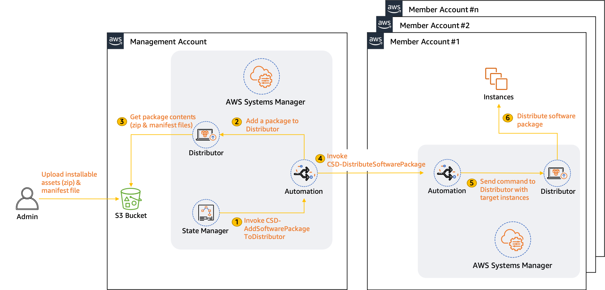
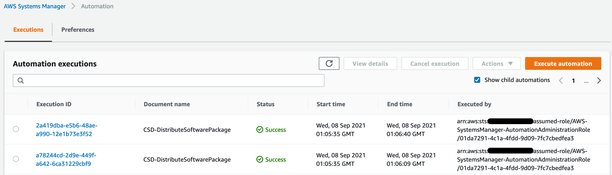
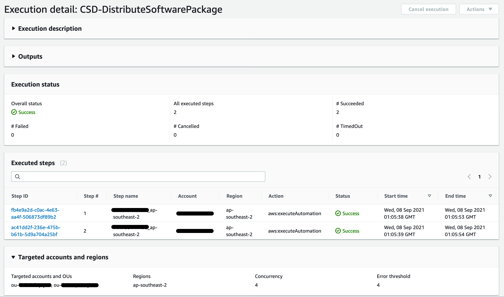
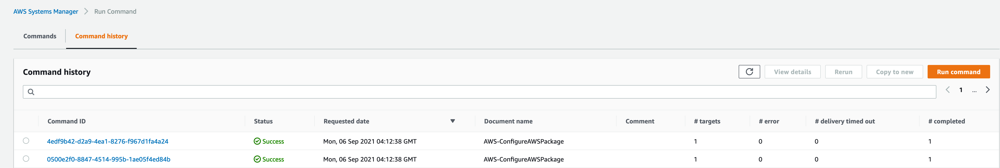

# Centralized software package distribution across multiple regions and accounts in an AWS Organization using AWS Systems Manager Distributor

Security remains a top priority for most organizations, and, in order to stay secure and compliant, they leverage agent-based vulnerability management tools, such as CrowdStrike, TrendMicro, and Tennable. AWS Systems Manager Distributor automates the process of packaging and publishing software to managed Windows and Linux instances across the cloud landscape, as well as to on-premises servers, via a single simplified interface. Customers can leverage Distributor to package and manage security and other monitoring agents, and then distribute them to cloud and on-premises instances as well.

Most customers have well-established landing zones built via AWS Organizations, with several AWS accounts spread across multiple regions. They want to centrally automate software package management and distribution across this large landscape. This post will demonstrate how you can build a solution that automates your software package distribution across all of your member accounts spread across regions within an AWS Organization via AWS Systems Manager. The key features leveraged are Automation, Distributor and State Manager.

# Prerequisites

The following prerequisites need to be completed Tto deploy this solution.

1. Prepare your .zip files of installable assets, with one .zip file per operating system platform. At least one .zip file is required to create a package. Next,
2. Create a JSON manifest. The manifest includes pointers to your package code files.
3. When you have your required code files added to a folder or directory, and the manifest is populated with correct values, then upload your package to an Amazon Simple Storage Service (S3) bucket. These have been described in the first 3 steps of [Create a package (advanced)](https://docs.aws.amazon.com/systems-manager/latest/userguide/distributor-working-with-packages-create.html#distributor-working-with-packages-create-adv).

> **Note** : To ensure optimal package management, we recommend only having the
> relevant files for a package uploaded in its own prefix within the S3 bucket 
> that is utilized solely for this purpose. This post uses the management
> account within AWS Organizations, but you can also designate an account to
> manage this on behalf of the organization, for more details refer to
> [Configuring a Delegated Administrator](https://docs.aws.amazon.com/systems-manager/latest/userguide/Explorer-setup-delegated-administrator.html).


# Solution overview

Distributor, a capability of AWS Systems Manager, helps you package your software within a region in an account. The Centralized Software Distributor (CSD) solution described in this post enhances your ability to manage and distribute software packages across member accounts that are spread across regions in an AWS Organization.

Figure 1 shows the solution architecture. In addition to Distributor, the solution utilizes the following Systems Manager capabilities.

- [Automation](https://docs.aws.amazon.com/systems-manager/latest/userguide/systems-manager-automation.html) to orchestrate the workflow.
- [State](https://docs.aws.amazon.com/systems-manager/latest/userguide/systems-manager-state.html) Manager to invoke the Automation document on a user-defined frequency.


<p align="center">Figure 1: Solution Architecture</p>

# Walkthrough

To deploy the solution, launch this CloudFormation stack in your organization&#39;s management account.

[](https://bhatprav-blog-artefacts.s3.ap-southeast-2.amazonaws.com/centralized-software-distributor/CloudFormation/template.yaml)

The template deploys the following resources:

1. **Automation documents**
  - _CSD-AddSoftwarePackageToDistributor_ which contains the logic to package the installable software assets and add it to Distributor.
  - _CSD-DistributeSoftwarePackage_ which contains the logic to distribute the software package to every target instance in the member accounts.

2. **IAM roles**
  - [AWS-SystemsManager-AutomationAdministrationRole](https://docs.aws.amazon.com/systems-manager/latest/userguide/systems-manager-automation-multiple-accounts-and-regions.html)
  - [AWS-SystemsManager-AutomationExecutionRole](https://docs.aws.amazon.com/systems-manager/latest/userguide/systems-manager-automation-multiple-accounts-and-regions.html)
  - [CSD-CloudFormationStackSetAdministrationRole](https://docs.aws.amazon.com/AWSCloudFormation/latest/UserGuide/stacksets-prereqs.html)
  - [CSD-CloudFormationStackSetExecutionRole](https://docs.aws.amazon.com/AWSCloudFormation/latest/UserGuide/stacksets-prereqs.html)

Provide the following inputs for the template:

- **CreateCloudFormationStackSetRoles:** Specify if the CloudFormation StackSet IAM roles should be provisioned. These roles will be utilized to deploy AWS-SystemsManager-AutomationExecutionRole in each target account. Refer to [Prerequisites for stack set operations](https://docs.aws.amazon.com/AWSCloudFormation/latest/UserGuide/stacksets-prereqs.html) for more details.
- **CreateSystemsManagerRoles:** Specify if the AWS Systems Manager IAM roles required to run automation in multiple accounts and regions should be provisioned. Refer to [Running automations in multiple AWS Regions and accounts](https://docs.aws.amazon.com/systems-manager/latest/userguide/systems-manager-automation-multiple-accounts-and-regions.html) for more details.
- **ManagementAccountId:** (Required) AWS Organization&#39;s Management account ID.
- **TargetKey:** Specify which instances have to be targeted for this solution. Allowed values - ParameterValues, ResourceGroup or begin with tag:, AWS::EC2::Instance, InstanceIds (default), instanceids. Refer to [Target](https://docs.aws.amazon.com/systems-manager/latest/APIReference/API_Target.html) for more details.
- **TargetValues:** Specify the target key values specified above. Default is \*, which targets every instance. Refer to [Target](https://docs.aws.amazon.com/systems-manager/latest/APIReference/API_Target.html) for more details.
- **TargetOUs:** Organization Unit (OU) IDs which are in scope for this solution in a comma-separated format (e.g., ou-abc1-abc12ab1,ou-def2-def12de1).

## Invoking the solution using a State Manager association

A [State Manager association](https://docs.aws.amazon.com/systems-manager/latest/userguide/systems-manager-state.html#state-manager-association-what-is) is a configuration assigned to your managed instances. The configuration defines the state you want to maintain on your instances.

Update the highlighted parameters, and then execute this command in the management account of your organization.

- **TARGET\_ACCOUNTS** : AWS account IDs and/or the organizational unit IDs within AWS Organization whose accounts have the target instances (e.g., ou-abcd-1qwert43, 123456789123) for distribution.
- **TARGTE\_REGIONS** : All AWS Regions (e.g., us-east-1) where the target instances are running.
- **MAX\_CONCURRENCY** and **MAX\_ERRORS:** Specifythese values based on the number of accounts and error thresholds described in [TargetLocation](https://docs.aws.amazon.com/systems-manager/latest/APIReference/API_TargetLocation.html) in the AWS Systems Manager API Reference.
- **ACTION:** Specify whether or not to install or uninstall the package.
- **INSTALLATION\_TYPE:** Specify the installation type. Uninstall and reinstall: The application is taken offline until the reinstallation process completes. In-place update: The application is available while new or updated files are added to the installation.
- **PACKAGE\_NAME:** The package to install/uninstall.
- **VERSION:** The package version to install or uninstall. If you don&#39;&#39;t specify a version, then by default the system installs the latest published version. The system will only attempt to uninstall the version currently installed. If no version of the package is installed, then the system returns an error.
- **ADDITIONAL\_ARGUMENTS:** The additional parameters to provide to your install, uninstall, or update scripts.
- **S3\_BUCKET\_NAME:** Specify the S3 bucket name where the package has been deployed to. This bucket should only consist of the packages and its manifest file.
- **S3\_BUCKET\_PREFIX:** Specify the S3 prefix (if used) where the package assets are stored.
- **AUTOMATION\_ROLE\_ARN** : ARN of the AWS-SystemsManager-AutomationAdministrationRole.

```
aws ssm create-association \
    --association-name "csd-association" \
    --name " CSD-AddSoftwarePackageToDistributor" \
    --parameters '{"targetAccounts":["TARGET_ACCOUNTS"],"targetRegions":["TARGET_REGIONS"],"maxConcurrency":["MAX_CONCURRENCY"],"maxErrors":["MAX_ERRORS"],"action":["ACTION"],"installationType":["INSTALLATION_TYPE"],"name":["PACKAGE_NAME"],"version":["VERSION"],"additionalArguments":["{ADDITIONAL_ARGUMENTS}"],"AutomationAssumeRole":["AUTOMATION_ROLE_ARN"],"bucketName":["S3_BUCKET_NAME"],"bucketPrefix":["S3_BUCKET_PREFIX"]}' \
    --no-apply-only-at-cron-interval
```

This command will invoke the system to run it once immediately after it is created. To update it to run on a scheduled basis using--schedule-expression, see [create-association](https://awscli.amazonaws.com/v2/documentation/api/latest/reference/ssm/create-association.html) in the AWS CLI Command Reference.

### Validating the execution ran successfully

After the association has triggered the automation, open the Systems Manager console, and from the left navigation pane choose **Automation**. In **Automation executions** , you should see the most recent execution of both CSD-AddSoftwarePackageToDistributor and CSD-DistributeSoftwarePackage, as shown in Figure 2.


<p align="center">Figure 2: Automation executions (management account))</p>

Click each execution to validate if they were completed successfully.

Depending on the number of regions, accounts, and instances that you execute this solution against, a successful run of the execution looks like the following in the CSD-DistributeSoftwarePackage execution details:


<p align="center">Figure 3: CSD-DistributeSoftwarePackage execution detail (management account)</p>

To ensure that the package was deployed to the targeted member account instances, navigate to the Systems Manager dashboard and select _Run Command_ in the left pane. Under _Command history_, you should be able to see every invocation and their status.


<p align="center">Figure 4: Run command history (member account)</p>

Click any **Command ID** , and then select the **instance ID** for the command output. Check the **Ouput** section for both steps. On a successful completion, you can expect a similar output as shown in Figure 5.

  
<p align="center">Figure 5: Run Command output (member account)</p>


## Adding new accounts, OUs, and Regions

The solution will automatically deploy to any new accounts that you provision under the OUs specified when you originally deployed the CloudFormation template. The addition of new accounts or OUs will require updates to _both CloudFormation_ and _State Manager Association_ as described below. The addition of new regions will only require updating the _Association_.

- **CloudFormation** (_complete these steps only if you provisioned the AWS-SystemsManager-Automation\* roles_):

    1. In the CloudFormation console, choose the original template you deployed, and then choose **Update**.
    2. Leave the **Use the current template** option selected.
    3. Under **Automation details** ,update the **STACKSET\_**** TARGETS**

- **State Manager Association** :

Update the association using the instructions provided in [Editing and creating a new version of an association](https://docs.aws.amazon.com/systems-manager/latest/userguide/sysman-state-assoc-edit.html) with the new accounts, OUs, and/or Regions.

# Conclusion

This post demonstrated how you can leverage AWS Systems Manager Distributor, as well as some of its other capabilities, to build a centralized software package distribution solution across all of your AWS accounts and Regions within an AWS Organization. With a consistent and reliable package management and distribution framework in place, you can now maintain your security and compliance posture across not only AWS, but also your on-premises infrastructure.


## Security

See [CONTRIBUTING](CONTRIBUTING.md#security-issue-notifications) for more information.

## License

This library is licensed under the MIT-0 License. See the LICENSE file.